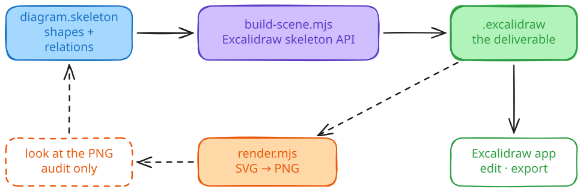

# excalidraw-skill

A Claude Code skill that draws system architectures, dependency graphs, sequence flows, and other diagrams as **editable `.excalidraw` files** — assembled with Excalidraw's own programmatic API, checked by rendering them locally with proper handwriting fonts and Korean/CJK glyphs.

No headless browser. No Python. No external CLI. Node scripts do the whole pipeline.

---

## What it does

You ask for a diagram in Claude Code:

> *"Draw the architecture of this service."*

Claude:

1. Picks a layout whose **shape itself** carries the argument (a fan-out really fans out, a pipeline reads left-to-right).
2. Writes a **skeleton** — shapes and the relationships between them, nothing else.
3. Builds it into a `.excalidraw` file with `convertToExcalidrawElements`, which wires every id, index, label binding and arrow binding.
4. Renders it to PNG, **looks at the result**, fixes what it sees, rebuilds.
5. Hands you the `.excalidraw` file.

You open it in Excalidraw, move a box, fix a label, and export whatever image you need from the app. The arrows follow the boxes, because the bindings are there.

The detailed authoring rules live in [`SKILL.md`](./SKILL.md) and [`references/`](./references/).

## Install

```bash
git clone https://github.com/jheun66/excalidraw-skill ~/.claude/skills/excalidraw
cd ~/.claude/skills/excalidraw
npm install
```

**Requires Node ≥ 20.19.** `npm install` also builds `scripts/.generated/excalidraw.mjs` (~13 MB, gitignored) — see [why](#why-a-bundle-step) below.

## Usage

### Inside Claude Code

Just ask. The skill auto-delegates on prompts like:

- *"Draw the architecture of this service."*
- *"Visualize the dependency graph between these crates."*
- *"Make a sequence diagram for the login flow."*

### From the CLI

Write a skeleton:

```json
{
  "elements": [
    { "type": "rectangle", "id": "api", "x": 0, "y": 0, "width": 200, "height": 90,
      "label": { "text": "API" } },
    { "type": "rectangle", "id": "db", "x": 0, "y": 220, "width": 200, "height": 90,
      "label": { "text": "DB" } },
    { "type": "arrow", "start": { "id": "api" }, "end": { "id": "db" },
      "label": { "text": "쿼리" } }
  ]
}
```

Build it, then render it if you want to look:

```bash
node scripts/build-scene.mjs flow.skeleton.json   # → flow.excalidraw
node scripts/render.mjs flow.excalidraw           # → flow.png, flow.svg
```

A `.mjs` skeleton is imported instead of parsed, so a repetitive layout can be computed rather than typed — see [`references/06-examples.md`](./references/06-examples.md).

First render extracts the bundled Excalidraw fonts to a local `fonts/` cache (~45 MB, gitignored) and reuses it afterwards.

## How it works



**Building** — `convertToExcalidrawElements` from `@excalidraw/excalidraw` expands each skeleton entry into a full element and wires the scene: element ids, fractional `index`, `containerId`, both directions of `boundElements`, `startBinding`/`endBinding` with `focus` and `gap`, style defaults. `build-scene.mjs` adds the one thing it does not do — running each bound arrow's path between the shapes it connects, clipped to each outline — then passes the result through `restore`, the same normalisation the editor applies on open, so the file on disk already matches what the app will hold.

**Rendering** — `@excalidraw/utils.exportToSvg` under a jsdom shim, then `@resvg/resvg-js` to PNG at 2×, pointed at the extracted font directory so handwriting and CJK glyphs survive into the raster.

### Why a bundle step

`@excalidraw/excalidraw` publishes one `.` export whose bundle is written for a web bundler, not Node's ESM resolver: extensionless imports, JSON without import attributes, a CJS-only dependency reached through a named import. `scripts/bundle-excalidraw.mjs` runs esbuild over the three functions this skill needs and writes the result to `scripts/.generated/`. It runs automatically on `npm install`.

Text measurement is the other thing a browser normally provides. Glyph advances decide how wide a label is and therefore whether it fits its box, so `build-scene.mjs` registers a provider through `setCustomTextMetricsProvider` — the package's own hook for "where canvas API is not available". The estimate is coarse and deliberately generous: full-width for CJK, ~0.58 em for Latin. Extra padding is invisible; coming up short clips the label.

## Why an authoring loop, not a one-shot

A diagram in technical docs should *prove* a relationship — not just label some boxes. The skill enforces a small loop:

1. Decide what the diagram has to argue (one sentence).
2. Choose a layout whose shape itself carries the argument.
3. Write the skeleton, build, render, *look at the image*, revise.

If the labels were peeled off and the structure still made sense, the diagram has done its job.

What the loop checks has narrowed, deliberately. Field-level mistakes — a missing binding, a clipped label, an inconsistent index — are structurally impossible on this path, so the audit spends its attention on the things no library can judge: overlap, crossing arrows, reading order, whether the arrow points the way the dependency actually runs. [`references/05-validation.md`](./references/05-validation.md) draws the line.

## Project layout

```
.
├── SKILL.md                     # main skill instructions
├── package.json
├── references/
│   ├── 01-json-schema.md        # what the built file looks like — for reading
│   ├── 02-drawing-api.md        # the skeleton format and the build script
│   ├── 03-color-palette.md      # default Excalidraw colors and how to extend them
│   ├── 04-layout-patterns.md    # vertical, horizontal, hub-spoke, sequence layouts
│   ├── 05-validation.md         # what's guaranteed vs. what only your eyes catch
│   ├── 06-examples.md           # small, runnable skeletons
│   ├── 07-render-embed.md       # build/render scripts, options, Markdown embedding
│   ├── 08-diagram-types.md      # per-category design vocabulary (16 diagram kinds)
│   └── 09-arrows.md             # arrow philosophy (when, head, style, color, path)
└── scripts/
    ├── build-scene.mjs          # skeleton → .excalidraw
    ├── bundle-excalidraw.mjs    # esbuild step, run by npm install
    ├── dom-shim.mjs             # jsdom + the browser APIs Excalidraw expects
    ├── render.mjs               # .excalidraw → SVG/PNG
    ├── render.sh                # bash wrapper around render.mjs
    └── extract-fonts.mjs        # one-time font cache extractor
```

## Troubleshooting

- **`Cannot find module ./.generated/excalidraw.mjs`.** The bundle step has not run. `npm install`, or `npm run build`.
- **PNG text shows as boxes / wrong font.** Delete the `fonts/` directory and re-render; it'll re-extract from the current `@excalidraw/utils` install.
- **`ERR_REQUIRE_ESM` from html-encoding-sniffer.** Make sure Node is ≥ 20.19. This is an upstream chain (`jsdom → html-encoding-sniffer → @exodus/bytes`) that requires Node's native `require(esm)` support.
- **CJK / Korean text doesn't render as handwriting.** Use `fontFamily: 5` (Excalifont). Excalidraw only activates the Xiaolai CJK fallback for Excalifont — Virgil and the others don't get the chain. It is already the default for anything the build script produces.

## References

- Excalidraw documentation — <https://docs.excalidraw.com/docs/>
- Element skeleton API — <https://docs.excalidraw.com/docs/@excalidraw/excalidraw/api/excalidraw-element-skeleton>
- CJK handwriting font (Xiaolai) — [Excalidraw Plus blog post](https://plus.excalidraw.com/blog/adding-hand-drawn-font-for-chinese-japanese-korean)

## License

[MIT](./LICENSE)
